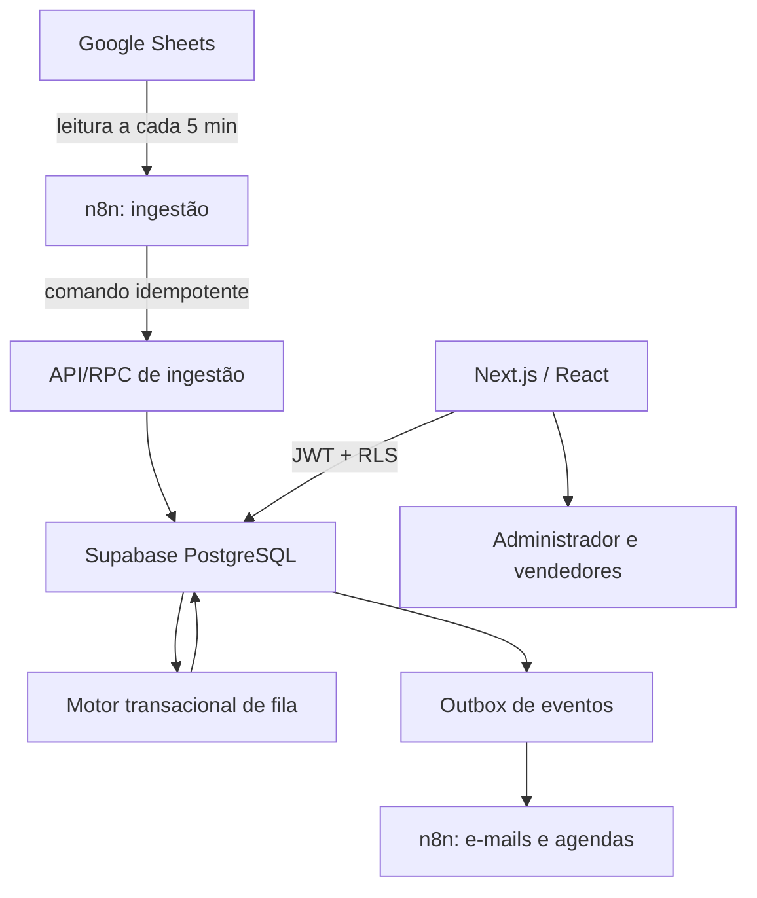
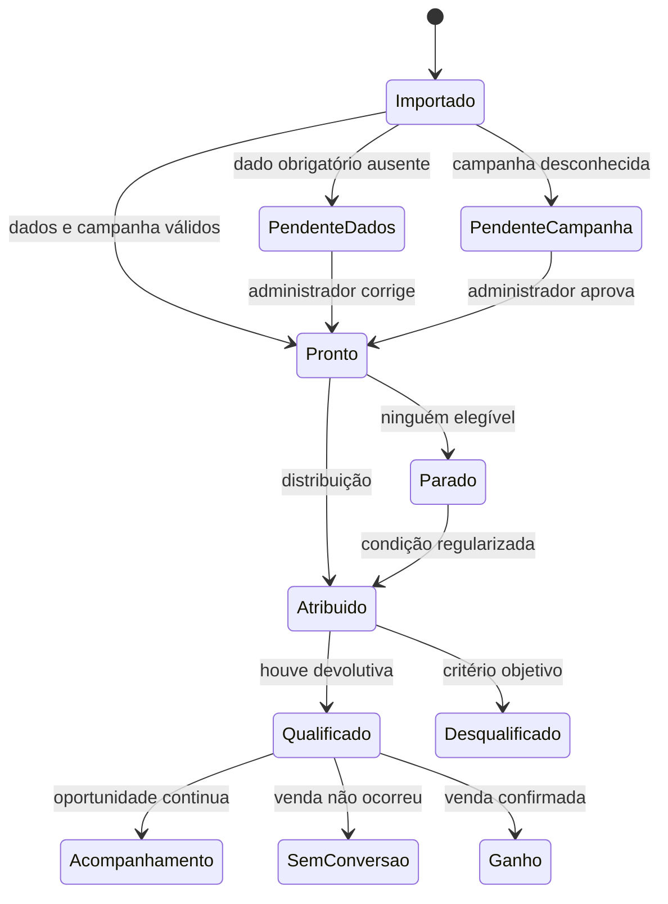
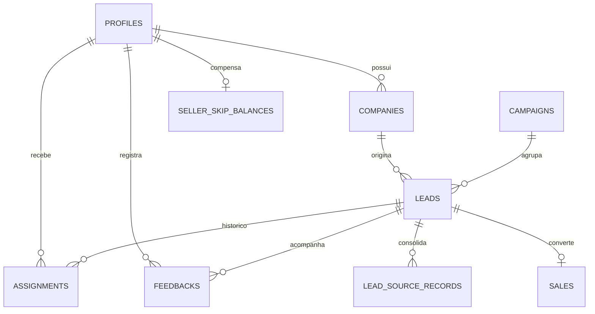

# Gerenciador de Leads WTG

## Especificação Funcional e Técnica — v1.0

**Data:** 25 de agosto de 2026  
**Status:** especificação consolidada para revisão  
**Produto:** sistema interno de distribuição, acompanhamento, qualificação e conversão de leads da WTG Corretora de Seguros  
**Fonte de verdade:** este documento substitui protótipos, trechos de código e interpretações anteriores sobre este projeto. Se uma implementação divergir desta especificação, a especificação prevalece até que uma alteração seja formalmente aprovada.

---

## 1. Como usar esta especificação com outra inteligência artificial

A IA responsável pelo desenvolvimento deve:

1. Ler este documento integralmente antes de propor código ou estrutura de pastas.
2. Não alterar silenciosamente nenhuma regra de negócio.
3. Identificar contradições entre o código existente e esta especificação antes de continuar.
4. Produzir um plano de implementação dividido em etapas pequenas e verificáveis.
5. Implementar primeiro o núcleo transacional e seus testes; a interface não deve anteceder as regras críticas de fila.
6. Usar migrações versionadas para qualquer alteração de banco de dados.
7. Aplicar TDD nas regras de distribuição, prazo útil, duplicidade, permissões e resultados finais.
8. Não colocar a lógica crítica de rodízio dentro do n8n.
9. Não expor chaves administrativas ou `service_role` no navegador.
10. Considerar concluído somente o que tiver critérios de aceite automatizados e evidência de validação.

### Prompt curto de inicialização para a IA desenvolvedora

> Leia integralmente `SPEC_GERENCIADOR_DE_LEADS_WTG.md`. Trate-o como fonte de verdade. Antes de programar, devolva: (1) resumo do entendimento; (2) riscos e dependências; (3) arquitetura proposta sem contrariar as decisões registradas; (4) plano de implementação testável. Não implemente antes da aprovação desse plano. Toda mudança de regra deve ser apresentada como proposta, nunca aplicada silenciosamente.

---

## 2. Resumo executivo

A WTG recebe leads em uma planilha Google alimentada por anúncios e outras fontes comerciais. O sistema deverá sincronizar essa planilha, organizar os leads por campanha e distribuí-los entre quatro vendedores por meio de uma única fila global:

1. Renato
2. Sandra
3. Jessica
4. Nelma

A distribuição não é apenas um rodízio simples. Um vendedor com qualquer feedback vencido fica temporariamente bloqueado para novas entregas e perde as suas próximas vezes naturais enquanto permanecer irregular. O sistema também precisa preservar o proprietário de uma empresa quando o mesmo CNPJ reaparecer em outra campanha, compensando futuramente quem recebeu entregas direcionadas fora do rodízio.

Depois da entrega, o vendedor registra contatos, tentativas e feedbacks periódicos. O sistema separa três conceitos que não podem ser confundidos:

- contato e acompanhamento;
- qualificação do lead;
- conversão em negócio ganho.

Não converter uma venda não desqualifica o lead. A desqualificação é reservada a critérios objetivos definidos pela WTG.

O MVP terá interface responsiva, autenticação por e-mail e senha, dashboards por perfil, campanhas, fila, pendências, histórico, exportações e notificações por e-mail. A integração de um chatbot e de uma caixa corporativa compartilhada do WhatsApp será uma fase posterior.

---

## 3. Problema que o produto resolve

O processo atual depende de uma planilha e de acompanhamento humano para responder perguntas operacionais críticas:

- Quem deve receber o próximo lead?
- Um vendedor está apto a receber ou está atrasado?
- Um lead está parado por falta de vendedor, campanha não aprovada ou dado incompleto?
- O mesmo CNPJ já possui um proprietário na WTG?
- O vendedor entrou em contato e manteve o acompanhamento atualizado?
- O lead foi realmente desqualificado ou apenas não converteu?
- Qual campanha produz mais leads qualificados?
- Quem deve receber crédito por uma venda quando houve direcionamento temporário?

Sem uma fonte operacional única, o rodízio pode se tornar injusto, leads podem ficar esquecidos e indicadores de qualificação podem ser distorcidos.

---

## 4. Objetivos do MVP

### 4.1 Objetivos de negócio

- Distribuir leads com ordem, justiça e rastreabilidade.
- Impedir novas entregas a vendedores que não mantêm feedbacks em dia.
- Preservar o relacionamento de empresas recorrentes com o mesmo proprietário.
- Diferenciar claramente lead qualificado, desqualificado, sem conversão e convertido.
- Permitir que o administrador identifique rapidamente tudo que está parado.
- Medir a qualidade dos leads e das campanhas sem confundir qualificação com venda.
- Reduzir acompanhamento manual, mensagens dispersas e decisões baseadas em memória.

### 4.2 Objetivos técnicos

- Garantir distribuição exatamente uma vez, mesmo com sincronizações ou requisições simultâneas.
- Tornar importações idempotentes.
- Preservar histórico completo de alterações, atribuições e resultados.
- Aplicar isolamento por perfil no banco de dados, não apenas na interface.
- Manter integrações externas desacopladas do núcleo de negócio.
- Permitir evolução posterior para WhatsApp corporativo sem refazer a modelagem principal.

### 4.3 Indicadores de sucesso do produto

- Nenhum lead apto é atribuído duas vezes por concorrência.
- Nenhum vendedor bloqueado recebe lead normal pelo rodízio.
- Todo lead atribuído possui proprietário atual, data de atribuição e prazo calculado.
- Todo resultado final possui autor, comentário e data.
- Toda mudança de fila ou proprietário feita pelo administrador é auditável.
- A taxa de qualificação por campanha pode ser reproduzida a partir dos dados brutos.
- As telas de vendedor nunca revelam indicadores ou leads de outros vendedores.

---

## 5. Escopo

### 5.1 Incluído no MVP

- Login por e-mail e senha.
- Perfis de administrador e vendedor.
- Sincronização Google Sheets → sistema a cada 5 minutos.
- Importação inicial completa e operação incremental posterior.
- Cadastro e aprovação de campanhas.
- Fila global de distribuição.
- Bloqueio por feedback atrasado.
- Fila FIFO de leads parados.
- Propriedade de empresa por CNPJ.
- Direcionamento recorrente entre campanhas.
- Créditos de pulos compensatórios.
- Direcionamento temporário e transferência permanente pelo administrador.
- Feedback periódico com comentário mínimo.
- Registro de tentativas de contato pelo WhatsApp.
- Qualificação, desqualificação, encerramento sem conversão e negócio ganho.
- Dashboards por campanha e por perfil.
- Central de pendências.
- Notificações e relatórios por e-mail.
- Exportação CSV/XLSX pelo administrador.
- Auditoria das ações críticas.
- Arquivamento de linhas removidas da origem.

### 5.2 Fora do MVP

- Chatbot de WhatsApp.
- Caixa de entrada compartilhada do WhatsApp.
- Envio automático de mensagens de WhatsApp.
- Escrita ou correção automática na planilha Google.
- Aplicativo móvel nativo.
- Transferência de leads realizada por vendedores.
- Filas diferentes por campanha.
- Campanhas restritas a subconjuntos de vendedores.
- Cadastro público de usuários.
- Previsão de vendas por inteligência artificial.
- Pontuação automática de leads.
- Integração com CRM financeiro, emissão de apólices ou comissionamento.

### 5.3 Fase futura: WhatsApp corporativo

A fase posterior deverá usar um único número corporativo compartilhado. O chatbot fará atendimento inicial e, quando necessário, entregará a conversa a uma pessoa real. A propriedade da conversa deverá respeitar o vendedor atualmente responsável pelo lead. O módulo futuro deverá ser integrado por uma interface de provedor, sem acoplar o domínio a uma ferramenta específica.

---

## 6. Abordagens arquiteturais avaliadas

### 6.1 Opção recomendada — núcleo transacional no Supabase/PostgreSQL

**Composição:** Next.js/React + TypeScript; Supabase Auth/PostgreSQL/RLS; n8n para Google Sheets, e-mails e agendas; Vercel para o frontend e APIs compatíveis.

**Vantagens:**

- A atribuição ocorre em transação de banco.
- Regras de concorrência podem usar bloqueios e constraints.
- O histórico e a auditoria permanecem próximos dos dados.
- RLS protege os dados mesmo se a interface tiver uma falha.
- O n8n pode falhar ou repetir um evento sem duplicar atribuições.

**Desvantagem:** exige cuidado maior na modelagem inicial e nos testes do banco.

**Decisão:** adotar esta abordagem.

### 6.2 Alternativa rejeitada — toda a regra de fila no n8n

Seria mais rápida para uma demonstração, mas exporia a operação a condições de corrida, execuções duplicadas, dificuldade de reprocessamento e baixa testabilidade. O n8n continuará importante, porém somente como orquestrador de integrações.

### 6.3 Alternativa adiada — backend totalmente próprio

Um serviço Node.js independente daria controle completo, mas aumentaria infraestrutura, autenticação, observabilidade e manutenção sem benefício proporcional para o tamanho inicial da equipe. Pode ser reconsiderado se o produto crescer para múltiplas empresas ou volume muito superior.

---

## 7. Arquitetura recomendada



### 7.1 Responsabilidades por componente

| Componente | Responsabilidade | Não deve fazer |
|---|---|---|
| Next.js/React | Interface, validação de experiência, APIs/ações de servidor | Decidir sozinho quem recebe um lead |
| Supabase Auth | Login, recuperação de senha, sessão | Cadastro público |
| PostgreSQL | Fonte de verdade, fila, ownership, estados, histórico, constraints | Enviar e-mails diretamente |
| RLS | Limitar leitura e escrita por usuário | Substituir validações de domínio |
| n8n ingestão | Ler a planilha, normalizar payload e chamar comando idempotente | Manter cursor de fila ou escolher vendedor |
| n8n notificações | Consumir eventos, consolidar e enviar e-mails | Alterar resultado de lead |
| Google Sheets | Entrada de dados da operação | Receber atualizações do sistema |
| Vercel | Hospedagem da aplicação | Armazenar segredos no cliente |

### 7.2 Princípio estrutural

As ações críticas deverão ser comandos explícitos do domínio. Não se deve permitir que o frontend atualize diretamente colunas sensíveis como `assignee_id`, `queue_cursor`, `won_by` ou `remaining_skips`.

---

## 8. Usuários iniciais

| Pessoa | E-mail | Perfil | Posição inicial |
|---|---|---|---:|
| Yago | yago@wtgseguros.com.br | Administrador | — |
| Renato | renato@wtgseguros.com.br | Vendedor | 1 |
| Sandra | sandracristina@wtgseguros.com.br | Vendedor | 2 |
| Jessica | jessicaalmeida@wtgseguros.com.br | Vendedor | 3 |
| Nelma | nelmacastro@wtgseguros.com.br | Vendedor | 4 |

### 8.1 Autenticação

- Login por e-mail e senha.
- Contas criadas somente pelo administrador ou por processo interno de convite.
- Não haverá cadastro público.
- Recuperação de senha será enviada ao e-mail do usuário.
- Ao desativar um usuário, suas sessões deverão ser revogadas e ele deixará de participar da fila.
- A desativação não apagará atribuições, feedbacks ou vendas históricas.

---

## 9. Papéis e permissões

### 9.1 Matriz de acesso

| Recurso/ação | Administrador | Vendedor |
|---|---:|---:|
| Ver todos os leads | Sim | Não |
| Ver leads próprios | Sim | Sim |
| Ver métricas globais | Sim | Não |
| Ver métricas próprias | Sim | Sim |
| Ver posição de todos na fila | Sim | Não |
| Ver a própria posição | Sim | Sim |
| Reordenar fila | Sim | Não |
| Pausar/reativar vendedor | Sim | Não |
| Aprovar campanha | Sim | Não |
| Editar campos vindos da planilha | Sim, com override auditado | Não |
| Registrar feedback em lead | Nota administrativa separada | Sim, se for responsável atual |
| Qualificar/desqualificar | Pode corrigir e reverter | Sim, no próprio lead |
| Marcar negócio ganho | Sim | Sim, no próprio lead |
| Reverter desqualificação | Sim | Não |
| Reverter negócio ganho | Sim | Não |
| Direcionar temporariamente | Sim | Não |
| Transferir propriedade permanentemente | Sim | Não |
| Exportar todos os dados | Sim | Não |
| Ver auditoria | Sim | Não |

### 9.2 Restrições adicionais do vendedor

- Não pode transferir leads.
- Não pode alterar a ordem da fila.
- Não pode ver nomes, atrasos, posições ou indicadores dos outros vendedores.
- Não pode editar CNPJ, empresa, telefone, e-mail, campanha ou campos de origem.
- Não pode registrar feedback em lead que não esteja atualmente atribuído a ele.
- Não pode reabrir um resultado final.

### 9.3 Notas administrativas

O administrador pode acrescentar uma nota administrativa, mas essa nota não conta como feedback do vendedor, não renova o SLA e não desbloqueia o vendedor. Isso impede regularização artificial do acompanhamento.

---

## 10. Glossário canônico

| Termo | Definição |
|---|---|
| Empresa | Entidade comercial identificada prioritariamente por CNPJ |
| Lead | Ocorrência comercial de uma empresa/contato dentro de uma campanha |
| Campanha | Origem comercial agrupadora dos leads |
| Anúncio | Peça/origem específica dentro de uma campanha; seu ID não é tratado como único por lead |
| Proprietário da empresa | Vendedor que recebeu a primeira atribuição válida daquele CNPJ, salvo transferência permanente |
| Responsável atual | Vendedor que deve atender o lead neste momento |
| Responsável temporário | Vendedor escolhido pelo administrador sem mudar o proprietário da empresa |
| Turno natural | Vez de um vendedor na ordem global do rodízio |
| Crédito de pulo | Débito de equidade que faz o vendedor perder uma futura vez natural por ter recebido lead direcionado |
| Feedback válido | Comentário operacional do responsável atual, após contato iniciado, com ao menos 6 caracteres úteis |
| Tentativa | Registro manual de contato pelo WhatsApp em um dia útil distinto |
| Qualificado | Lead que deu uma devolutiva real após contato, positiva ou negativa |
| Desqualificado | Lead que atende um dos critérios objetivos de desqualificação |
| Sem conversão | Lead qualificado que não gerou venda; não é desqualificação |
| Negócio ganho | Conversão confirmada; a empresa passa a ser cliente |
| Lead parado | Lead ainda não entregue por impedimento operacional |
| Override | Valor editado pelo administrador que passa a prevalecer sobre a planilha naquele campo |

---

## 11. Modelo conceitual de estados

O sistema não deverá usar uma única coluna genérica de “fase” para representar tudo. Cada eixo possui finalidade própria.

### 11.1 Eixos de estado

| Eixo | Valores principais |
|---|---|
| Origem | ativo, arquivado |
| Campanha | aprovação pendente, aprovada, arquivada |
| Atribuição | pendência de dados, pendência de campanha, pronto, parado, atribuído |
| Qualificação | pendente, qualificado, desqualificado |
| Conversão | ativo, acompanhamento qualificado, encerrado sem conversão, ganho |

### 11.2 Fluxo principal do lead



### 11.3 Regras de terminalidade

- `desqualificado`, `encerrado sem conversão` e `ganho` encerram o SLA de feedback.
- Um lead `qualificado em acompanhamento` continua sujeito a feedback periódico.
- Apenas o administrador pode reverter `desqualificado` ou `ganho`.
- A reversão gera evento de auditoria; o registro anterior não é apagado.
- `negócio ganho` pode ser registrado uma única vez por lead enquanto o estado não for revertido pelo administrador.

---

## 12. Contrato da planilha Google

### 12.1 Direção da integração

```text
Google Sheets  ───── leitura ─────>  Gerenciador de Leads
Google Sheets  <──── proibido ─────  Gerenciador de Leads
```

O sistema nunca deve inserir, alterar, reorganizar ou apagar células da planilha.

### 12.2 Colunas canônicas

| Ordem | Coluna | Obrigatoriedade | Uso |
|---:|---|---|---|
| A | ID do Lead | Obrigatória em produção | Identidade estável e idempotência |
| B | Data de entrada | Obrigatória | Ordenação, métricas e importação inicial |
| C | ID do anúncio | Recomendada | Rastreabilidade da origem; não é chave única |
| D | Nome do anúncio | Recomendada | Exibição e análise |
| E | ID da Campanha | Recomendada | Identidade externa da campanha |
| F | Nome da campanha | Obrigatória | Aprovação e agrupamento |
| G | Nome da Empresa | Opcional | Empresa exibida; usar o nome do contato como fallback |
| H | Número p/ contato | Obrigatória | Contato comercial |
| I | E-mail | Obrigatória | Contato e deduplicação auxiliar |
| J | CPF/CNPJ | Obrigatória | Identificação; vazio ou inválido gera pendência |
| K | Estado | Obrigatória | Avaliação manual de abrangência |
| L | Nome | Obrigatória | Pessoa de contato |
| M | Fase | Opcional operacionalmente | Armazenada apenas como dado de origem |
| N | Valor estimado | Opcional | Contexto comercial e relatórios |
| O | Proprietário do relacionamento | Opcional | Referência da origem, não controla a fila |

### 12.3 Regras dos identificadores

- `ID do Lead` é a única identidade de origem que deve ser única e estável.
- `ID do anúncio` é armazenado, mas o sistema não presume unicidade. Vários leads podem vir do mesmo anúncio.
- Linhas podem mudar de posição sem alterar o lead, pois o número da linha não é identidade.
- Uma linha sem `ID do Lead` não entra em produção. Registros legados devem receber um ID antes da sincronização inicial.

### 12.4 Validade mínima para distribuição

Para entrar na fila, a linha precisa ter `ID do Lead`, `Data de entrada`, campanha, nome do contato, telefone, e-mail, documento válido e Estado. A ausência de qualquer um desses dados cria pendência administrativa e impede a atribuição. Pendências de dados não contam para o limiar de dois leads parados, pois ainda não estão aptas à distribuição.

### 12.5 Normalização

- CNPJ/CPF: manter somente dígitos para comparação; preservar versão formatada apenas para exibição.
- Telefone: normalizar para código do país + DDD + número quando possível.
- E-mail: `trim` e comparação sem diferença entre maiúsculas e minúsculas.
- Estado: converter para sigla de duas letras.
- Datas: converter para instante usando `America/Sao_Paulo`.
- Valores: converter para decimal monetário sem depender de símbolo ou separador visual.
- Textos: remover espaços externos; não destruir acentos.

### 12.6 Modos de sincronização

#### Bootstrap

- Importar todas as linhas válidas.
- Não distribuir automaticamente todo o histórico.
- O administrador escolhe manualmente a quantidade de leads que deseja liberar por lote.
- Cada lote preserva ordem FIFO por `Data de entrada`, com `ID do Lead` como desempate.
- Após o lote, cada vendedor recebe um único e-mail consolidado com suas atribuições.

#### Operação normal

- Executar sincronização a cada 5 minutos.
- Novas linhas criam um registro de origem e criam ou atualizam a ocorrência comercial correspondente.
- Linhas alteradas atualizam campos sem override administrativo.
- Linhas idênticas não geram trabalho nem eventos novos.
- Linhas removidas arquivam seus registros de origem; a ocorrência comercial só é arquivada quando não restar outra origem ativa, e o histórico nunca é apagado.

### 12.7 Linha removida

Ao desaparecer do snapshot da origem:

- marcar o registro de origem como ausente/arquivado;
- registrar data e motivo `removed_from_source`;
- arquivar a ocorrência e retirá-la de filas/SLAs somente quando não restar outro registro de origem ativo vinculado à mesma ocorrência;
- preservar atribuições, feedbacks, vendas e auditoria;
- não excluir empresa ou campanha.

### 12.8 Precedência de edição

```text
override administrativo > valor atual da planilha > valor anterior importado
```

- Campo sem override acompanha a planilha.
- Editar um campo no sistema cria override por campo, com autor e data.
- Se a planilha mudar um campo com override, abrir conflito para análise manual.
- Até a resolução, o valor administrativo continua visível e operacional.
- “Aceitar origem” remove o override e aplica o valor da planilha.
- “Manter edição” fecha o conflito e preserva o override.
- Vendedores têm somente leitura desses campos.

### 12.9 Coluna `Fase`

A `Fase` da planilha é dado informativo de origem. Ela não pode atribuir lead, desqualificar, marcar venda, alterar proprietário ou substituir os estados internos.

---

## 13. Identidade, duplicidade e recorrência

### 13.1 Níveis de identidade

1. **Registro de origem:** uma linha identificada por `source_lead_id`.
2. **Empresa:** CNPJ normalizado.
3. **Ocorrência comercial:** empresa + campanha.

Mais de um registro de origem pode apontar para a mesma ocorrência comercial. Essa separação é obrigatória para preservar IDs únicos da planilha sem duplicar um lead do mesmo CNPJ na mesma campanha.

### 13.2 Regras de deduplicação

- Mesmo `ID do Lead`: atualizar o mesmo registro de origem e sua ocorrência vinculada.
- Novo `ID do Lead`, mas mesmo CNPJ e mesma campanha: criar novo registro de origem vinculado à ocorrência existente; não criar outra ocorrência comercial.
- Mesmo CNPJ e campanha diferente: criar nova ocorrência ligada à mesma empresa.
- A combinação auxiliar de duplicidade é CNPJ + telefone + e-mail, todos normalizados.
- O sistema pode sinalizar provável duplicidade por telefone/e-mail, mas não deve mesclar automaticamente empresas com CNPJs diferentes.
- Sem CNPJ não há mesclagem automática de empresa.

### 13.3 Documento ausente ou inválido

- Campo vazio ou documento com quantidade inválida de dígitos gera `pendência de dados` e impede distribuição.
- Um CPF válido pode entrar na operação como contato identificado; o vendedor decide manualmente se a ausência de CNPJ desqualifica o lead.
- O administrador pode corrigir o documento. A correção dispara nova verificação de duplicidade antes da distribuição.

### 13.4 Mesmo CNPJ e mesma campanha após resultado final

No MVP, a nova linha atualiza a ocorrência existente e não abre automaticamente um novo ciclo comercial. Se a WTG quiser uma nova oportunidade na mesma campanha, o administrador deverá reabrir explicitamente o lead, gerando auditoria.

---

## 14. Campanhas

### 14.1 Regras gerais

- A campanha vem em coluna da planilha.
- Toda campanha desconhecida nasce como `aprovação pendente`.
- Somente o administrador pode aprovar.
- Enquanto pendente, seus leads não são distribuídos.
- Leads de campanha pendente contam como parados para o alerta operacional.
- Ao aprovar, os leads elegíveis entram na fila FIFO pela data original de entrada.
- Todas as campanhas usam a mesma fila global e os mesmos quatro vendedores.
- Não há especialização de vendedores por campanha no MVP.

### 14.2 Identidade da campanha

- Preferir `ID da Campanha` como chave externa.
- Se o ID estiver ausente, usar nome normalizado apenas para localizar a proposta de campanha.
- O administrador pode definir um nome de exibição diferente do texto da planilha.
- O nome de exibição não altera o valor da origem.

### 14.3 Tela de campanha

Cada campanha deverá apresentar:

- nome de exibição;
- ID externo;
- anúncios vinculados;
- quantidade de leads recebidos;
- atribuídos, parados, pendentes, qualificados, desqualificados e ganhos;
- taxa de qualificação;
- taxa de conversão;
- tempo médio até primeiro feedback;
- período filtrado;
- lista de leads.

---

## 15. Fila global de distribuição

### 15.1 Ordem inicial

```text
Renato → Sandra → Jessica → Nelma → Renato → ...
```

### 15.2 Princípios

- Existe um único cursor global, compartilhado por todas as campanhas.
- O cursor representa a próxima vez natural.
- A ordem pode ser alterada somente pelo administrador.
- A atribuição precisa ocorrer em transação serializada.
- Uma campanha nunca mantém cursor próprio.
- Um lead direcionado por recorrência não movimenta o cursor global.

### 15.3 Elegibilidade do vendedor

O vendedor está elegível se, simultaneamente:

- usuário ativo;
- não está pausado/ausente;
- não possui nenhum lead ativo com feedback vencido;
- não está sendo pulado por crédito compensatório naquela vez natural.

### 15.4 Bloqueio por atraso

- Um único feedback atrasado bloqueia novas atribuições normais.
- O bloqueio é derivado dos dados; não deve depender de um botão manual.
- A verificação crítica compara `feedback_due_at` com o relógio do banco no momento da distribuição; não depende de um cron ter marcado previamente o vendedor como bloqueado.
- O vendedor permanece responsável pelos leads já atribuídos.
- Registrar feedback válido regulariza aquele lead.
- O vendedor volta a estar disponível somente quando não restar nenhum lead atrasado.
- Regularizar não concede entrega imediata e não restaura uma vez perdida.
- Ele será considerado quando o cursor alcançar novamente sua posição.

### 15.5 Perda de vez

Quando chega a vez de um vendedor bloqueado, pausado ou com crédito de pulo:

1. a vez é consumida;
2. o cursor avança;
3. o lead procura o próximo candidato;
4. a vez não fica guardada;
5. não existe compensação por bloqueio ou ausência.

### 15.6 Pseudocódigo do rodízio normal

```text
função distribuir_lead_normal(lead):
    adquirir bloqueio transacional da fila global

    enquanto existir pelo menos um vendedor operacionalmente disponível:
        vendedor = fila[cursor]
        cursor = próxima_posição(cursor)

        se vendedor está inativo, ausente ou possui atraso:
            registrar pulo por indisponibilidade
            continuar

        se vendedor possui créditos_de_pulo > 0:
            decrementar exatamente 1 crédito
            registrar pulo compensatório
            continuar

        atribuir lead ao vendedor
        iniciar SLA de feedback
        registrar histórico e evento de notificação
        confirmar transação
        retornar atribuição

    marcar lead como parado por falta de vendedor elegível
    confirmar transação
```

Se todos os vendedores disponíveis possuírem créditos de pulo, o algoritmo pode completar novas voltas na mesma transação até consumir os créditos necessários e encontrar o primeiro candidato elegível. Se todos estiverem realmente bloqueados/ausentes, o lead fica parado.

### 15.7 Concorrência

- Duas sincronizações simultâneas não podem ler e atualizar o mesmo cursor sem bloqueio.
- Usar lock transacional exclusivo para a fila global, por exemplo advisory lock ou linha única com `SELECT ... FOR UPDATE`.
- A atribuição, o avanço do cursor, o consumo de crédito e a criação do histórico devem confirmar ou falhar juntos.
- Cada lead possui constraint que impede duas atribuições atuais.

### 15.8 Reordenação

- Apenas administrador.
- Exibir ordem anterior e nova em auditoria.
- Reordenar não apaga créditos de pulo.
- O próximo cursor deve ser remapeado para a identidade do vendedor que era o próximo, não apenas para o número do índice, evitando mudança acidental da vez.

---

## 16. Empresas recorrentes e propriedade

### 16.1 Definição do proprietário

- O primeiro vendedor a receber uma atribuição efetiva de um CNPJ torna-se proprietário da empresa.
- Um lead parado não define proprietário.
- A propriedade pertence à empresa, não à campanha.
- A propriedade não muda quando surge novo lead em campanha diferente.

### 16.2 Novo lead da mesma empresa em campanha diferente

Quando um CNPJ conhecido reaparece em outra campanha:

1. criar uma nova ocorrência de lead;
2. vinculá-la à empresa existente;
3. direcioná-la ao proprietário da empresa;
4. não avançar o cursor global;
5. adicionar um crédito de pulo ao vendedor que recebeu a entrega direcionada.

### 16.3 Créditos de pulo

- Um lead direcionado gera um crédito.
- Três leads direcionados geram três créditos.
- Cada crédito é consumido em uma futura vez natural do vendedor.
- Os créditos podem atravessar várias rotações.
- O saldo nunca pode ficar negativo.
- O administrador visualiza o saldo de todos.
- O vendedor visualiza apenas o próprio saldo, sem informações dos colegas.

### 16.4 Proprietário bloqueado

- Se o proprietário estiver bloqueado ou pausado, o lead recorrente aguarda.
- O lead conta como parado para o alerta operacional.
- O sistema não o entrega automaticamente a outro vendedor.
- Quando o proprietário se regulariza, o lead recorrente pode ser atribuído imediatamente a ele, pois não depende da vez natural.
- O SLA começa somente na atribuição efetiva.

### 16.5 Direcionamento temporário

O administrador pode escolher outro responsável para atender um lead recorrente parado.

- O proprietário da empresa permanece original.
- O vendedor temporário torna-se responsável atual do lead.
- A atribuição temporária não altera o cursor.
- O vendedor temporário recebe um crédito de pulo.
- Se ele marcar negócio ganho, o crédito da venda é dele.
- Futuras recorrências continuam indo ao proprietário original.

### 16.6 Transferência permanente

- Somente o administrador pode transferir.
- Altera o proprietário da empresa para os leads futuros.
- Não reescreve responsáveis ou créditos de vendas históricas.
- Deve exigir motivo e confirmação.
- Gera evento de auditoria com proprietário anterior e novo.

---

## 17. Leads parados e fila FIFO

### 17.1 Motivos

| Motivo | Distribuição automática | Conta no alerta de 2 parados |
|---|---:|---:|
| Todos os vendedores bloqueados/ausentes | Sim, ao surgir elegibilidade | Sim |
| Proprietário recorrente bloqueado | Sim, quando ele regulariza | Sim |
| Campanha aguardando aprovação | Sim, depois da aprovação | Sim |
| Dado mínimo ausente ou inválido | Sim, depois da correção | Não |

### 17.2 Ordem FIFO

- Ordenar por `Data de entrada`.
- Usar `ID do Lead` como desempate estável.
- A prioridade não muda quando o motivo da pendência muda.
- Leads recorrentes respeitam seu proprietário e não concorrem com a fila normal.

### 17.3 Incidente de dois parados

- Abrir incidente quando a contagem elegível cruza de menos de 2 para 2 ou mais.
- Enviar um único alerta ao administrador por incidente.
- Enquanto o incidente estiver aberto, novos leads não geram alertas repetidos.
- Resolver quando a contagem cai para menos de 2.
- Um novo cruzamento após a resolução abre novo incidente.
- Leads com pendência de dados — inclusive CNPJ, telefone ou e-mail — aparecem no painel, mas não entram nessa contagem.

### 17.4 Falta total de vendedores

Se todos estiverem bloqueados ou pausados:

- os leads normais permanecem parados;
- nenhum é descartado;
- a ordem FIFO é preservada;
- quando alguém se regularizar, o distribuidor é acionado automaticamente;
- o vendedor regularizado recebe apenas conforme a posição do cursor, exceto lead recorrente que pertence a ele.

---

## 18. SLA e feedback periódico

### 18.1 Prazo

- Prazo inicial: 24 horas úteis após a atribuição.
- Sábados, domingos, feriados nacionais e feriados estaduais de São Paulo não contam.
- Feriados municipais não entram no MVP.
- Fuso: `America/Sao_Paulo`.
- Não há janela comercial de 9h às 18h; o relógio conta continuamente em dias elegíveis e pausa integralmente em dias não úteis.

### 18.2 Exemplos

| Atribuição | Calendário | Vencimento |
|---|---|---|
| Quinta, 10h | Sexta útil | Sexta, 10h |
| Sexta, 14h | Fim de semana comum | Segunda, 14h |
| Sexta, 14h | Segunda é feriado | Terça, 14h |

### 18.3 Lembrete

- Enviar 4 horas úteis antes do vencimento.
- O lembrete é transacional e não deve esperar o resumo diário.
- Criar chave idempotente por `lead + ciclo de SLA + tipo de lembrete`.

### 18.4 Feedback válido

Um feedback é válido quando:

- foi criado pelo responsável atual;
- está vinculado a uma ação explícita de contato/retorno;
- possui comentário com pelo menos 6 caracteres após remover espaços externos;
- não é apenas uma nota administrativa;
- não é duplicação idempotente da mesma submissão.

### 18.5 Renovação de prazo

- Cada feedback válido cria um novo ciclo de 24 horas úteis enquanto o lead estiver ativo.
- O ciclo anterior fica no histórico.
- Resultado final encerra o ciclo atual.
- Um comentário posterior ao vencimento regulariza aquele lead e cria novo prazo, caso ele continue ativo.
- O vendedor só é desbloqueado se nenhum outro lead dele permanecer atrasado.

### 18.6 Duração do acompanhamento

O acompanhamento é por tempo indeterminado. Não existe encerramento automático por idade do lead. Ele permanece ativo até que seja qualificado e encerrado, desqualificado, ganho ou arquivado por decisão válida.

---

## 19. Tentativas de contato

### 19.1 Regra

- Canal inicial do MVP: WhatsApp.
- Limite operacional: 5 tentativas.
- As tentativas devem ocorrer em 5 dias úteis distintos.
- No máximo uma tentativa conta por lead em cada data útil.
- Cada tentativa exige comentário válido.
- O sistema registra autor, data, hora, canal e número sequencial.

### 19.2 Após a quinta tentativa

- O sistema habilita o motivo `Não atende após 5 tentativas`.
- A desqualificação continua manual.
- O sistema nunca desqualifica automaticamente.
- Tentativas por telefone ou e-mail podem ser descritas no comentário, mas não substituem a contagem de WhatsApp no MVP.

### 19.3 Integridade

- Não permitir tentativa futura.
- Não permitir duas tentativas contabilizadas no mesmo dia útil.
- Não permitir tentativa em sábado, domingo ou feriado configurado.
- Correção de tentativa contabilizada exige administrador e auditoria.

---

## 20. Qualificação, desqualificação e conversão

### 20.1 Qualificação

Um lead é qualificado quando houve devolutiva real do contato após conversa iniciada pelo vendedor. A devolutiva pode ser positiva ou negativa.

Para qualificar:

- responsável atual realiza a ação;
- comentário com ao menos 6 caracteres;
- ação confirma explicitamente que houve resposta do contato;
- registrar data da decisão.

### 20.2 Não conversão

Não comprar, recusar proposta, escolher concorrente ou adiar a contratação não são motivos de desqualificação quando houve uma conversa real.

Nesses casos:

- `qualification_status = qualified`;
- `conversion_status = closed_no_conversion` quando o acompanhamento terminar;
- o lead continua contando como qualificado na taxa de campanha;
- não conta como negócio ganho.

### 20.3 Motivos permitidos de desqualificação

1. Não atende após 5 tentativas válidas em dias úteis distintos.
2. Não possui CNPJ.
3. Não pertence ao Estado de São Paulo.

Nenhum outro motivo pode ser escrito livremente como categoria. O comentário detalha o contexto, mas a categoria deve ser uma das três.

### 20.4 Avaliação manual

- O Estado diferente de SP não bloqueia a distribuição automaticamente; o vendedor analisa e desqualifica manualmente.
- Um CPF pode ser distribuído para análise; o vendedor pode confirmar ausência de CNPJ e desqualificar manualmente.
- Documento vazio ou inválido fica em pendência administrativa antes da distribuição.
- O sistema não toma decisão comercial automática com base apenas nos dados da planilha.

### 20.5 Negócio ganho

- Exige comentário válido.
- Marca o lead como qualificado e ganho.
- Converte a empresa em cliente.
- Registra responsável creditado, data e histórico.
- Se havia responsável temporário, a venda é creditada a ele.
- O proprietário original da empresa não muda por causa da venda temporária.
- A ação é idempotente e não pode criar dois eventos de venda para o mesmo lead.
- Somente o administrador pode reverter.

### 20.6 Resultado final e propriedade

Qualificar, desqualificar, encerrar sem conversão ou ganhar não muda automaticamente o proprietário da empresa.

---

## 21. Métricas e fórmulas

### 21.1 Taxa de qualificação

```text
leads qualificados
──────────────────────────────────────────────
leads qualificados + leads desqualificados
```

- Negócios ganhos pertencem ao conjunto de qualificados.
- Qualificados encerrados sem conversão continuam no numerador.
- Leads pendentes, novos, em contato ou parados não entram no denominador.
- O filtro de período usa `qualification_decided_at`.

### 21.2 Taxa de conversão dos qualificados

```text
negócios ganhos
────────────────────────────
leads qualificados decididos
```

### 21.3 SLA de primeiro feedback

```text
leads com primeiro feedback dentro do prazo
────────────────────────────────────────────
leads atribuídos com prazo já mensurável
```

### 21.4 Indicadores do administrador

- Leads recebidos.
- Leads distribuídos.
- Leads parados por motivo.
- Campanhas pendentes.
- CNPJs/documentos pendentes.
- Taxa de qualificação geral e por campanha.
- Conversões e valor estimado ganho.
- Feedbacks próximos do vencimento e atrasados.
- Tempo médio até primeira interação.
- Distribuição por vendedor.
- Créditos de pulo pendentes.
- Histórico de conflitos com a planilha.

### 21.5 Indicadores do vendedor

Somente seus próprios dados:

- leads ativos;
- feedbacks próximos do vencimento;
- feedbacks atrasados;
- qualificados;
- ganhos;
- taxa de qualificação própria;
- sua posição atual na fila;
- seu saldo de pulos compensatórios.

O vendedor não recebe totais individuais dos colegas.

### 21.6 Dimensão temporal

- Entrada: `source_entered_at`.
- Atribuição: `assigned_at`.
- Feedback: `feedback_created_at`.
- Qualificação: `qualification_decided_at`.
- Venda: `won_at`.

Cada gráfico deve declarar qual data utiliza. Não filtrar todos os indicadores por uma única coluna genérica.

---

## 22. Notificações e e-mails

### 22.1 Identidade de envio

- Remetente: `contato@wtgseguros.com.br`.
- Nome de exibição recomendado: `WTG — Contato Comercial`.
- Não copiar automaticamente o administrador nos e-mails de vendedor.

### 22.2 E-mails do vendedor

| Evento | Destinatário | Forma |
|---|---|---|
| Novas atribuições da operação normal | Somente vendedor responsável | Um consolidado diário por vendedor às 9h |
| Lote da importação inicial | Somente vendedor responsável | Um consolidado ao concluir o lote |
| Prazo a 4 horas úteis | Responsável atual | Imediato/transacional |
| Feedback vencido | Responsável atual | Uma notificação por ciclo vencido |

Se o vendedor não tiver novas atribuições no período, não enviar resumo vazio.
As atribuições aparecem imediatamente no dashboard; a consolidação afeta apenas o e-mail, não a disponibilidade do lead no sistema nem o início do SLA.

### 22.3 E-mails do administrador

As categorias não devem ser combinadas no mesmo e-mail:

1. Campanhas aguardando aprovação — consolidado diário às 9h.
2. Leads com CNPJ/documento pendente — consolidado diário às 9h.
3. Relatório geral de pendências — consolidado diário às 9h.
4. Incidente de 2 ou mais leads parados elegíveis — alerta no momento do cruzamento do limite.

### 22.4 Outbox e idempotência

- A transação de negócio grava um evento em `notification_outbox`.
- O n8n consome eventos pendentes.
- Cada mensagem usa uma chave idempotente.
- Falha de e-mail não desfaz atribuição ou feedback.
- Reenvios preservam o mesmo evento e incrementam tentativas.
- Após limite de tentativas, mover para fila de falha e alertar administrador.

---

## 23. Experiência do usuário

### 23.1 Diretrizes gerais

- Interface em português do Brasil.
- Desktop-first, responsiva para tablet e celular.
- Estados e prazos devem ser entendidos por texto, não apenas cor.
- Datas exibidas no horário de São Paulo.
- Ações finais exigem confirmação clara.
- A interface nunca deve sugerir que “desqualificado” significa “não vendeu”.

### 23.2 Rotas recomendadas

```text
/login
/dashboard
/leads
/leads/:id
/campanhas
/campanhas/:id
/fila
/pendencias
/relatorios
/configuracoes
```

As rotas podem compartilhar o mesmo shell, mas o conteúdo é filtrado pelo perfil no servidor e no banco.

### 23.3 Dashboard do administrador

- KPIs globais.
- Filtro de período.
- Filtro de campanha.
- Taxa de qualificação por campanha.
- Conversão.
- Total e motivos de leads parados.
- Lista da fila com estados e créditos.
- Feedbacks atrasados.
- Campanhas para aprovação.
- Sincronização mais recente.

### 23.4 Dashboard do vendedor

- Somente indicadores próprios.
- Próximos vencimentos.
- Atrasados.
- Leads ativos.
- Qualificados e ganhos.
- Posição individual na fila.
- Não exibir nomes nem estados dos demais vendedores.

### 23.5 Lista de leads

Filtros:

- campanha;
- responsável;
- estado de atribuição;
- qualificação;
- conversão;
- prazo;
- Estado;
- período;
- busca por empresa, contato, CNPJ, telefone ou e-mail.

Colunas mínimas:

- empresa/contato;
- campanha/anúncio;
- responsável atual;
- proprietário da empresa quando diferente;
- estado de qualificação;
- estado de conversão;
- próximo prazo;
- número de tentativas;
- data de entrada.

### 23.6 Detalhe do lead

- Dados importados.
- Sinalização de override/conflito.
- Campanha e anúncio.
- Empresa e proprietário.
- Responsável atual e tipo de atribuição.
- Linha do tempo completa.
- SLA atual.
- Tentativas.
- Formulário de feedback.
- Ações de qualificar, desqualificar, encerrar sem conversão e ganhar.
- Link para abrir WhatsApp ou copiar o telefone; abrir a conversa não registra tentativa automaticamente.

### 23.7 Tela de fila

Administrador:

- ordem completa;
- próximo cursor;
- estado de cada vendedor;
- número de atrasos;
- saldo de créditos de pulo;
- ações de subir/descer, pausar e reativar;
- histórico de alterações.

Vendedor:

- somente sua posição;
- se está elegível ou bloqueado;
- motivo próprio do bloqueio;
- saldo próprio de pulos.

### 23.8 Central de pendências

Separar em abas ou grupos:

- campanhas pendentes;
- documentos/CNPJ pendentes;
- leads parados por disponibilidade;
- proprietários recorrentes bloqueados;
- feedbacks atrasados;
- conflitos de origem;
- falhas de sincronização/notificação.

### 23.9 Exportação

- Somente administrador no MVP.
- CSV e XLSX.
- Respeitar filtros atuais.
- Incluir data/hora, usuário que exportou e quantidade de registros na auditoria.
- Não incluir segredos, hashes de senha ou payloads técnicos.

---

## 24. Casos de uso principais

### UC-01 — Sincronizar nova linha

**Ator:** n8n/serviço.  
**Pré-condição:** linha possui ID do Lead.  
**Fluxo:** normalizar → validar → deduplicar → resolver campanha/empresa → gravar → distribuir ou deixar pendente.  
**Pós-condição:** uma única ocorrência criada ou atualizada, com histórico da sincronização.

### UC-02 — Distribuir lead normal

**Ator:** sistema.  
**Fluxo:** bloquear fila → avaliar cursor → consumir pulos necessários → atribuir → criar SLA → registrar outbox → confirmar.  
**Pós-condição:** exatamente um responsável ou motivo de parada.

### UC-03 — Registrar feedback

**Ator:** responsável atual.  
**Fluxo:** escrever comentário válido → opcionalmente registrar tentativa → salvar → renovar SLA.  
**Pós-condição:** histórico imutável e possível desbloqueio derivado.

### UC-04 — Qualificar

**Ator:** responsável atual.  
**Fluxo:** confirmar devolutiva → comentar → escolher continuidade ou encerramento sem conversão.  
**Pós-condição:** taxa de qualificação atualizada sem marcar venda automaticamente.

### UC-05 — Desqualificar

**Ator:** responsável atual.  
**Fluxo:** selecionar motivo permitido → cumprir pré-condições → comentar → confirmar.  
**Pós-condição:** SLA encerrado e evento auditado.

### UC-06 — Marcar negócio ganho

**Ator:** responsável atual.  
**Fluxo:** comentar → confirmar → registrar venda única.  
**Pós-condição:** empresa cliente, crédito ao responsável atual, propriedade preservada.

### UC-07 — Aprovar campanha

**Ator:** administrador.  
**Fluxo:** revisar campanha → aprovar → liberar leads FIFO.  
**Pós-condição:** leads elegíveis processados pela fila.

### UC-08 — Direcionar temporariamente

**Ator:** administrador.  
**Fluxo:** escolher lead recorrente parado → escolher vendedor → informar motivo → confirmar.  
**Pós-condição:** responsável temporário, proprietário original intacto, crédito de pulo criado.

### UC-09 — Transferir empresa

**Ator:** administrador.  
**Fluxo:** escolher novo proprietário → justificar → confirmar.  
**Pós-condição:** futuras recorrências usam o novo proprietário; histórico preservado.

---

## 25. Modelo de dados recomendado

### 25.1 Entidades

| Entidade | Finalidade | Campos essenciais |
|---|---|---|
| `profiles` | Perfil do usuário autenticado | user_id, nome, e-mail, papel, ativo |
| `seller_queue` | Ordem e disponibilidade administrativa | seller_id, posição, pausado, versão |
| `queue_state` | Cursor global | next_seller_id, versão, updated_at |
| `seller_skip_balances` | Créditos compensatórios | seller_id, saldo |
| `campaigns` | Campanhas internas e externas | external_id, source_name, display_name, status |
| `companies` | Empresa consolidada | cnpj, nome, estado, owner_id, client_since |
| `leads` | Ocorrência por empresa/campanha | company_id, campaign_id, dados operacionais, estados |
| `lead_source_records` | Linhas/IDs da planilha vinculados à ocorrência | source_lead_id, lead_id, source_row, row_hash, payload, present |
| `assignments` | Histórico de responsáveis | lead_id, seller_id, tipo, início, fim, autor |
| `feedback_cycles` | Cada SLA de 24h úteis | lead_id, start_at, reminder_at, due_at, closed_at |
| `feedbacks` | Comentários operacionais | lead_id, seller_id, comment, created_at |
| `contact_attempts` | Tentativas contabilizadas | lead_id, seller_id, channel, attempt_date |
| `qualification_events` | Decisões de qualificação | lead_id, outcome, reason, comment, actor |
| `sales` | Negócio ganho idempotente | lead_id único, credited_seller_id, won_at |
| `business_holidays` | Calendário nacional/SP | date, name, scope |
| `source_snapshots` | Execuções e presença dos registros de origem | sync_id, source_record_id, present |
| `field_overrides` | Precedência administrativa por campo | lead_id, field_name, value, actor |
| `source_conflicts` | Mudanças conflitantes | lead_id, field_name, source/admin values, status |
| `notification_outbox` | Eventos para integração | event_type, aggregate_id, idempotency_key, status |
| `notification_incidents` | Controle de alertas únicos | type, opened_at, resolved_at |
| `audit_log` | Trilha imutável | actor, entity, action, before, after, created_at |
| `system_settings` | Parâmetros globais | timezone, SLA, lembrete, limiar, horário digest |

### 25.2 Relações principais



### 25.3 Constraints essenciais

- `profiles.email` único sem diferença de caixa.
- `companies.cnpj` único quando presente e válido.
- `lead_source_records.source_lead_id` único.
- ocorrência ativa única por `company_id + campaign_id`.
- uma atribuição atual por lead.
- `sales.lead_id` único.
- saldo de pulo maior ou igual a zero.
- posição de fila única entre vendedores ativos.
- comentário com mínimo de 6 caracteres após `trim`.
- uma tentativa contabilizada por lead/data útil.
- motivo de desqualificação pertencente ao conjunto permitido.
- `won_at` obrigatório quando conversão for ganha.

### 25.4 Histórico

Tabelas de evento não devem ser atualizadas destrutivamente. Correções criam eventos de reversão ou novos registros. Dados atuais podem ser materializados nas tabelas principais para consulta rápida, mas devem ser reproduzíveis a partir do histórico crítico.

---

## 26. Comandos de domínio e contratos de API

Os nomes abaixo são recomendados; a implementação pode ajustar rotas sem alterar semântica.

### 26.1 Ingestão

`POST /api/internal/imports/google-sheets/sync`

Requisitos:

- autenticação de serviço;
- `sync_run_id` e idempotency key;
- coleção de linhas normalizadas;
- resposta por linha: criada, atualizada, ignorada, pendente ou erro;
- não retornar segredos.

### 26.2 Feedback

`POST /api/leads/:leadId/feedbacks`

Payload conceitual:

```json
{
  "comment": "Contato respondeu e pediu retorno amanhã.",
  "contactStarted": true,
  "attempt": {
    "count": true,
    "channel": "whatsapp",
    "businessDate": "2026-08-25"
  },
  "idempotencyKey": "uuid"
}
```

O servidor calcula os prazos. O cliente nunca envia `due_at` como fonte de verdade.

### 26.3 Resultado

`POST /api/leads/:leadId/outcome`

Resultados aceitos:

- `qualified_follow_up`;
- `qualified_closed_no_conversion`;
- `disqualified`;
- `won`.

Todos exigem comentário; `disqualified` exige motivo; `won` cria registro de venda.

### 26.4 Administração

- `POST /api/admin/campaigns/:id/approve`
- `POST /api/admin/queue/reorder`
- `POST /api/admin/sellers/:id/pause`
- `POST /api/admin/leads/:id/temporary-assignment`
- `POST /api/admin/companies/:id/transfer-owner`
- `POST /api/admin/source-conflicts/:id/resolve`
- `POST /api/admin/leads/:id/reverse-outcome`

### 26.5 Leitura

As consultas devem aplicar RLS e filtros no servidor. Não baixar todos os leads para filtrar no navegador.

---

## 27. Eventos de domínio

Eventos mínimos:

- `lead.imported`
- `lead.source_updated`
- `lead.archived`
- `lead.parked`
- `lead.assigned`
- `lead.feedback_due_soon`
- `lead.feedback_overdue`
- `lead.feedback_recorded`
- `lead.qualified`
- `lead.disqualified`
- `lead.closed_without_conversion`
- `lead.won`
- `campaign.detected`
- `campaign.approved`
- `seller.blocked`
- `seller.unblocked`
- `seller.skip_credited`
- `seller.skip_consumed`
- `company.owner_transferred`
- `source.conflict_detected`
- `parked.threshold_crossed`

Cada evento deve ter ID único, instante, agregado, ator quando aplicável e payload versionado.

---

## 28. Segurança e LGPD

### 28.1 Controles obrigatórios

- RLS em todas as tabelas com dados comerciais.
- Políticas de vendedor baseadas no responsável atual e em histórico permitido.
- Rotas administrativas verificam papel no servidor.
- `service_role` somente em ambiente seguro de backend/n8n.
- Segredos em variáveis de ambiente ou cofre, nunca no repositório.
- Senhas gerenciadas pelo Supabase Auth; nunca armazenadas em tabela própria.
- Proteção contra enumeração de contas no login/recuperação.
- Auditoria de exportação e ações finais.
- Sessão expirada e logout confiável.

### 28.2 Dados pessoais

Telefone, e-mail, nome, CPF/CNPJ e histórico de contato são dados protegidos. Exibir apenas a usuários com necessidade operacional. Logs técnicos não devem copiar payload completo sem necessidade.

### 28.3 RLS esperada

- Administrador: acesso operacional completo.
- Vendedor: leitura de leads cujo responsável atual é ele; histórico necessário de leads que atendeu pode ser mantido em visão restrita, sem permitir novas alterações.
- Feedback: inserção somente pelo responsável atual.
- Fila global: vendedor recebe apenas uma projeção da própria posição.
- Métricas: consultas de vendedor sempre filtradas por seu usuário no banco.

---

## 29. Falhas, consistência e recuperação

### 29.1 Sincronização repetida

Resultado esperado: nenhuma duplicação. O `ID do Lead` identifica o registro de origem, o hash evita atualizações vazias e a chave empresa + campanha consolida a ocorrência comercial.

### 29.2 Falha no meio da atribuição

Resultado esperado: transação inteira é revertida. Não pode avançar cursor sem atribuir, nem atribuir sem criar histórico.

### 29.3 E-mail indisponível

Resultado esperado: ação de negócio permanece confirmada; evento continua na outbox para nova tentativa.

### 29.4 Feriado ausente

O administrador pode adicionar/corrigir o calendário. O sistema recalcula apenas ciclos ainda abertos e registra a alteração; ciclos encerrados permanecem históricos.

### 29.5 Usuário desativado com leads ativos

- Pausar imediatamente novas entregas.
- Exibir pendência ao administrador.
- Não transferir automaticamente.
- Administrador decide direcionamento temporário ou transferência permanente.

### 29.6 Campanha renomeada na planilha

Se `ID da Campanha` for o mesmo, atualizar `source_name` sem criar campanha. Preservar o nome de exibição administrativo.

Se o `ID da Campanha` de um registro de origem mudar:

- antes de qualquer atribuição, remapear a ocorrência e revalidar a aprovação normalmente;
- depois de atribuição, feedback ou resultado, não reescrever o histórico automaticamente; abrir conflito para o administrador decidir entre corrigir a campanha histórica ou criar/vincular uma nova ocorrência.

### 29.7 Alteração de CNPJ

É uma mudança sensível:

- revalidar empresa e duplicidade;
- se existir override, abrir conflito;
- se a empresa mudar, não migrar ownership automaticamente sem revisão administrativa;
- impedir mesclagem silenciosa de históricos.

---

## 30. Auditoria

Registrar ao menos:

- login relevante e falhas de acesso;
- criação/desativação de usuário;
- reordenação e pausa da fila;
- atribuição e seus pulos;
- créditos criados/consumidos;
- feedbacks e tentativas;
- decisões de qualificação;
- negócio ganho e reversões;
- aprovação de campanha;
- overrides e conflitos;
- direcionamento temporário e transferência permanente;
- importações e arquivamentos;
- exportações.

Cada registro deve conter `actor_id`, ação, entidade, antes/depois quando aplicável, instante e correlation ID.

---

## 31. Observabilidade

### 31.1 Painel técnico do administrador

- última sincronização;
- duração;
- linhas lidas, criadas, atualizadas, ignoradas e com erro;
- último e-mail enviado por fluxo;
- eventos pendentes na outbox;
- falhas definitivas;
- versão da aplicação e da migração.

### 31.2 Logs

- Estruturados em JSON.
- Correlation ID por sincronização/comando.
- Não registrar senha, token ou conteúdo integral de dados pessoais sem necessidade.
- Diferenciar erro recuperável de violação de regra.

### 31.3 Alertas técnicos

- sincronização sem sucesso por período superior ao esperado;
- fila de outbox crescendo;
- erro de autenticação do Google Sheets;
- falha do provedor de e-mail;
- migração de banco inconsistente.

---

## 32. Requisitos não funcionais

| Categoria | Requisito |
|---|---|
| Consistência | Nenhuma atribuição dupla; comandos críticos transacionais |
| Idempotência | Importações, feedbacks, resultados e e-mails aceitam repetição segura |
| Desempenho | P95 das telas comuns abaixo de 2 segundos em condições normais |
| Escalabilidade | Paginação e filtros no servidor; sem carregar toda a base no cliente |
| Disponibilidade | Falha de integração não interrompe consultas e feedbacks já disponíveis |
| Acessibilidade | Navegação por teclado, foco visível, rótulos e contraste adequados |
| Responsividade | Uso funcional em desktop, tablet e celular |
| Localização | pt-BR, moeda BRL e horário de São Paulo |
| Histórico | Dados operacionais não são apagados fisicamente por ações comuns |
| Backup | Backups automáticos do banco e procedimento de restauração testado |
| Segurança | RLS, segredos server-side, auditoria e princípio do menor privilégio |

---

## 33. Estratégia de testes

### 33.1 Testes unitários

- normalização de CNPJ/CPF, telefone, e-mail e datas;
- cálculo de 24 horas úteis;
- lembrete de 4 horas úteis;
- fins de semana e feriados;
- chave de duplicidade;
- elegibilidade de vendedor;
- consumo de créditos de pulo;
- fórmulas de métricas.

### 33.2 Testes de banco/integrados

- distribuição concorrente;
- rollback do cursor;
- mesmo CNPJ/mesma campanha;
- mesmo CNPJ/campanha diferente;
- owner bloqueado;
- atribuição temporária;
- constraint de venda única;
- RLS de administrador/vendedor;
- override e conflito;
- arquivamento de linha removida;
- outbox idempotente.

### 33.3 Testes ponta a ponta

- login de cada perfil;
- vendedor não vê colegas;
- administrador aprova campanha;
- lead passa por novo → contato → qualificado → ganho;
- cinco tentativas → desqualificação manual;
- feedback atrasado bloqueia e regularização remove bloqueio;
- exportação administrativa;
- recuperação de senha.

### 33.4 Relógio controlável

Testes de SLA não podem depender do relógio real. O serviço de tempo deve ser injetável para simular sexta-feira, fim de semana e feriado.

---

## 34. Critérios de aceite em cenários

### AC-01 — Rodízio básico

**Dado** cursor em Renato e todos elegíveis  
**Quando** quatro leads normais forem processados em sequência  
**Então** Renato, Sandra, Jessica e Nelma recebem exatamente um, nessa ordem.

### AC-02 — Vendedor atrasado perde a vez

**Dado** cursor em Renato e Renato com um feedback vencido  
**Quando** chegar um lead normal  
**Então** Renato é pulado, Sandra recebe e o cursor avança após Sandra.

### AC-03 — Regularização não restaura vez

**Dado** Renato foi pulado por atraso  
**Quando** ele registrar feedback válido  
**Então** não recebe imediatamente um lead normal; aguarda o próximo retorno natural do cursor.

### AC-04 — Um atraso é suficiente

**Dado** vendedor com dez leads ativos e apenas um vencido  
**Então** ele fica bloqueado para novas entregas.

### AC-05 — Todos bloqueados

**Dado** todos os vendedores bloqueados  
**Quando** chegar um lead apto  
**Então** o lead fica parado, sem responsável e em FIFO.

### AC-06 — Liberação da fila parada

**Dado** leads normais parados e Sandra se regulariza  
**Quando** o distribuidor for acionado  
**Então** processa FIFO respeitando o cursor, sem furar a ordem.

### AC-07 — Recorrência entre campanhas

**Dado** CNPJ proprietário de Renato na campanha A  
**Quando** surgir na campanha B  
**Então** cria novo lead, atribui a Renato, não move cursor e adiciona um crédito de pulo a Renato.

### AC-08 — Múltiplas recorrências

**Dado** Renato recebeu três leads direcionados  
**Então** perde suas três próximas vezes naturais, mesmo em rotações diferentes.

### AC-09 — Proprietário recorrente bloqueado

**Dado** novo lead recorrente de Renato e Renato bloqueado  
**Então** o lead espera por Renato e conta como parado; não vai automaticamente a Sandra.

### AC-10 — Direcionamento temporário

**Dado** lead recorrente de Renato parado  
**Quando** administrador direcionar temporariamente a Sandra  
**Então** Sandra atende, recebe um crédito de pulo e Renato continua proprietário da empresa.

### AC-11 — Venda temporária

**Dado** Sandra como responsável temporária  
**Quando** marcar negócio ganho com comentário válido  
**Então** a venda é creditada a Sandra e a empresa continua de Renato.

### AC-12 — Duplicidade na mesma campanha

**Dado** CNPJ já existente na campanha A  
**Quando** nova sincronização trouxer o mesmo CNPJ/campanha  
**Então** vincula o novo registro de origem, atualiza a ocorrência e não cria outra ocorrência comercial.

### AC-13 — Linha movida

**Dado** a linha mudou de posição, mas manteve ID do Lead  
**Então** o mesmo registro é atualizado.

### AC-14 — Linha removida

**Dado** ID do Lead não aparece no snapshot completo  
**Então** o registro de origem é arquivado; a ocorrência é arquivada somente se nenhum outro registro de origem ativo permanecer vinculado, e nada é apagado.

### AC-15 — Override administrativo

**Dado** administrador alterou telefone no sistema  
**Quando** a planilha trouxer outro telefone  
**Então** o valor administrativo permanece e nasce conflito manual.

### AC-16 — Campanha nova

**Dado** campanha desconhecida  
**Quando** seus leads forem importados  
**Então** ficam pendentes e contam como parados até aprovação.

### AC-17 — Documento vazio

**Dado** linha sem CPF/CNPJ  
**Então** fica em pendência de dados, não é distribuída e não entra no limiar de dois parados.

### AC-18 — Prazo no fim de semana

**Dado** lead atribuído sexta às 14h e sem feriado  
**Então** o prazo vence segunda às 14h e o lembrete ocorre segunda às 10h.

### AC-19 — Comentário inválido

**Dado** comentário com menos de 6 caracteres úteis  
**Então** não salva, não renova prazo e não desbloqueia vendedor.

### AC-20 — Feedback periódico

**Dado** lead ativo com feedback válido  
**Então** abre novo ciclo de 24 horas úteis.

### AC-21 — Cinco tentativas

**Dado** quatro tentativas válidas  
**Então** não permite desqualificar como não atende.  
**Quando** a quinta tentativa em dia útil distinto for registrada  
**Então** habilita a decisão manual.

### AC-22 — Não converteu

**Dado** cliente respondeu, mas recusou a proposta  
**Então** pode ser qualificado e encerrado sem conversão; não pode ser desqualificado por esse motivo.

### AC-23 — Estado fora de SP

**Dado** lead com Estado RJ  
**Então** é entregue normalmente com alerta visual; o vendedor decide manualmente pela desqualificação.

### AC-24 — Negócio ganho

**Dado** lead ativo e comentário válido  
**Quando** responsável marcar ganho  
**Então** cria uma única venda, transforma empresa em cliente e encerra SLA.

### AC-25 — Permissões do vendedor

**Dado** Renato autenticado  
**Então** não consegue consultar leads, métricas ou posição individual de Sandra, nem diretamente pela API.

### AC-26 — Alerta de dois parados

**Dado** contagem elegível passou de 1 para 2  
**Então** enviar um alerta ao administrador.  
**Quando** subir para 3 no mesmo incidente  
**Então** não repetir.  
**Quando** cair para 1 e depois voltar a 2  
**Então** enviar novo alerta.

### AC-27 — E-mail diário por vendedor

**Dado** Sandra recebeu vários leads desde o último resumo  
**Às** 9h  
**Então** recebe um único e-mail com somente seus leads.

### AC-28 — Venda única sob repetição

**Dado** dupla submissão do botão negócio ganho com a mesma idempotency key  
**Então** existe uma venda e uma resposta idempotente, não duas vendas.

### AC-29 — Concorrência

**Dado** dois novos leads processados simultaneamente  
**Então** cada um recebe uma atribuição única e o cursor final é equivalente ao processamento sequencial.

### AC-30 — Administrador não desbloqueia com nota

**Dado** lead atrasado de Jessica  
**Quando** administrador escrever nota administrativa  
**Então** o atraso e o bloqueio permanecem.

---

## 35. Ordem recomendada de desenvolvimento

Esta ordem é de dependência, não uma autorização automática para implementar.

1. Fundação do repositório, ambientes e qualidade.
2. Modelo de dados e migrações.
3. Auth, perfis e RLS.
4. Calendário útil e serviço de prazo.
5. Motor transacional da fila com testes concorrentes.
6. Importação idempotente e deduplicação.
7. Campanhas e pendências.
8. Feedbacks, tentativas e bloqueios.
9. Qualificação, conversão e propriedade.
10. Outbox e notificações.
11. Interface do administrador.
12. Interface do vendedor.
13. Dashboards, métricas e exportação.
14. Auditoria, observabilidade e recuperação.
15. Piloto controlado com importação em lotes.
16. Estabilização antes da fase WhatsApp.

---

## 36. Ambientes e entrega

### 36.1 Ambientes

- `development`: dados sintéticos, serviços locais ou projetos separados.
- `staging`: cópia estrutural de produção, sem contatos reais ou com dados anonimizados.
- `production`: dados reais e integrações oficiais.

Nenhum ambiente deve compartilhar chaves administrativas com outro.

### 36.2 CI/CD

- lint;
- typecheck;
- testes unitários;
- testes de banco/RLS;
- build;
- migrações validadas;
- deploy de preview;
- aprovação antes de produção.

### 36.3 Migrações

- Nunca editar migração aplicada.
- Uma nova alteração gera nova migração.
- Toda migração possui rollback operacional ou plano de recuperação.
- Seed de desenvolvimento separado de produção.

---

## 37. Dependências de configuração para implantação real

Antes do go-live, serão necessários:

- projeto Supabase e variáveis de ambiente;
- planilha Google oficial e nome da aba;
- credencial de leitura da Google Sheets;
- instância n8n;
- provedor SMTP/transacional autorizado para `contato@wtgseguros.com.br`;
- lista anual de feriados nacionais e estaduais de SP;
- domínio/URL final da aplicação;
- política de retenção e backup;
- senhas iniciais ou fluxo de convite dos cinco usuários.

Essas configurações não alteram as regras desta especificação.

---

## 38. Decisões canônicas consolidadas

1. A fila é global e começa em Renato → Sandra → Jessica → Nelma.
2. Todas as campanhas usam todos os vendedores.
3. Um atraso bloqueia novas entregas.
4. A vez perdida não é guardada.
5. Regularização não gera lead normal imediato.
6. Feedback vence em 24 horas úteis e renova periodicamente.
7. Lembrete ocorre 4 horas úteis antes.
8. Fins de semana, feriados nacionais e estaduais de SP não contam.
9. Comentário válido exige 6 caracteres úteis.
10. São 5 tentativas pelo WhatsApp, em dias úteis distintos.
11. Desqualificação é sempre manual.
12. Não converter não é desqualificar.
13. Qualificado significa que houve devolutiva real.
14. Negócio ganho transforma a empresa em cliente.
15. Apenas administrador reverte desqualificação ou venda.
16. Mesmo CNPJ/mesma campanha atualiza; campanha diferente cria nova ocorrência.
17. Primeiro recebedor torna-se proprietário da empresa.
18. Recorrência vai ao proprietário e gera crédito de pulo.
19. Créditos podem atravessar várias rotações.
20. Proprietário bloqueado faz o lead esperar.
21. Administrador pode direcionar temporariamente ou transferir permanentemente.
22. Venda temporária é creditada ao temporário sem mudar proprietário.
23. Campanhas desconhecidas exigem aprovação administrativa.
24. Campanhas pendentes contam como paradas.
25. Documento vazio fica pendente e não conta no alerta de dois parados.
26. O alerta de dois parados é único por incidente.
27. Google Sheets é somente entrada; o sistema nunca escreve nela.
28. Admin overrides prevalecem e mudanças conflitantes exigem análise manual.
29. Sincronização ocorre a cada 5 minutos.
30. Importação inicial é completa e liberada em lotes manuais.
31. Linhas removidas são arquivadas, nunca apagadas.
32. E-mail de atribuição é consolidado e enviado somente ao vendedor responsável.
33. Relatórios administrativos são separados e enviados às 9h.
34. Vendedor vê apenas seus leads, métricas e posição.
35. Somente administrador reordena a fila e gerencia ausências.
36. WhatsApp corporativo compartilhado fica para a fase posterior.

---

## 39. Regra de governança da especificação

Qualquer alteração futura deve registrar:

- regra anterior;
- nova regra;
- motivo;
- impacto em dados existentes;
- impacto em métricas;
- migração necessária;
- novos testes de aceite;
- aprovação de Yago/administrador do produto.

Nenhuma IA ou desenvolvedor deve “melhorar” uma regra de negócio sem apresentar a mudança explicitamente.

---

## 40. Encerramento

O núcleo do produto é uma máquina operacional auditável, não apenas um dashboard. A qualidade da solução dependerá principalmente de quatro pontos:

1. distribuição transacional;
2. separação entre qualificação e conversão;
3. propriedade consistente de empresas recorrentes;
4. proteção de dados e permissões reais no banco.

Uma implementação que tenha uma interface bonita, mas não consiga provar essas quatro propriedades, não atende esta especificação.
